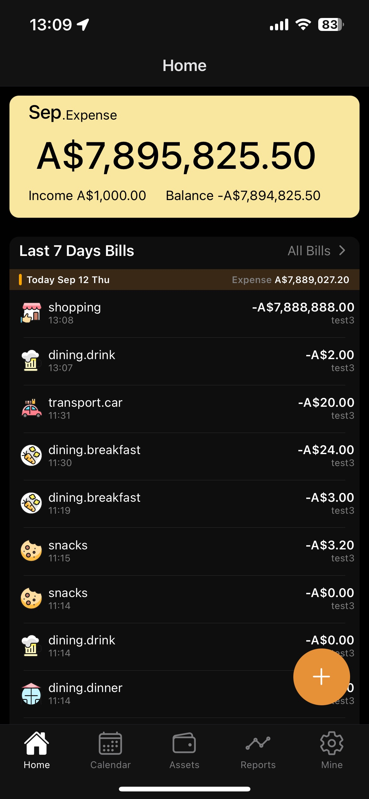
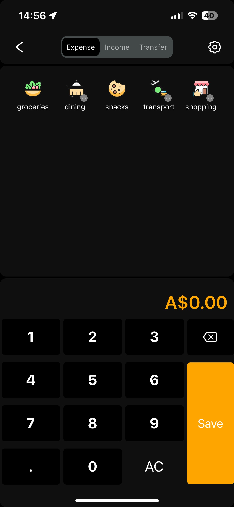

# Expense Tracker Mobile App💸

## Project Overview

**Expense Tracker App** is a mobile application designed to help users record and track their daily expenses while providing insightful data analysis. The app allows users to categorize their expenses, set budgets, and visualize their spending habits through data-driven reports and graphs.

🔗 Current Status: Under development 🚧

## Key Features✨

- **Expense Recording**: Users can log their daily expenses, categorize them (e.g., food, transportation, entertainment), and set custom tags.
- **User Registration & Login**: Secure user sign-up and authentication via Firebase.
- **Expense Overview Page**: Displays a list of recorded expenses with filters for date, category, and tags.
- **Data Analytics & Reports**: Provides users with data visualization tools, including pie charts and bar graphs to analyze spending patterns.
- **Database Integration**: User data, including expenses, categories, and reports, is stored securely in SQLite.

## Tech Stack 🛠️

- **Frontend**: React Native
- **Backend**: Node.js
- **Database**: SQLite
- **API**: RESTful

## Features Completed So Far 🏗️

1. **Expense Overview**: Displays all expenses from the past seven days as well as a summary of income and expenses for the current month. Each bill entry can be edited directly from this page.
2. **Create Bill**: By clicking the floating action button (FAB) in the bottom-right corner, users can enter the bill creation interface, where they can choose the category, bill name, amount, description, and other relevant details.
3. **Database Design**: Fully designed the **SQLite** table structure, including three tables: `expense`, `category`, and `assets`. CRUD (Create, Read, Update, Delete) operations have been implemented for each table.

## Upcoming Features 💡

- **Budgeting**: Users will be able to set monthly budgets for different categories and get alerts when they exceed their budget.
- **Push Notifications**: Reminders to log daily expenses or alert users when nearing budget limits.
- **Data Analytics**: Enhanced data analysis tools to display user spending trends with charts, graphs, and reports.
- **Export Data**: Ability to export expense data as CSV or PDF for external use.

## Future Roadmap 🚀

- **Version 1.0**: Full expense tracking functionality with category management and expense history.
- **Version 1.1**: Budgeting features and push notifications.
- **Version 2.0**: Advanced data analytics and exporting functionality (CSV, PDF).

## Contribution Guidelines 🤝

Contributions are welcome! Feel free to open issues or submit pull requests. Suggestions for new features or improvements are also appreciated.

## Contact Information ✉️

For any questions or inquiries, feel free to reach out via Hongyu.Zhu.zz@gmail.com or create an issue on this GitHub repository.